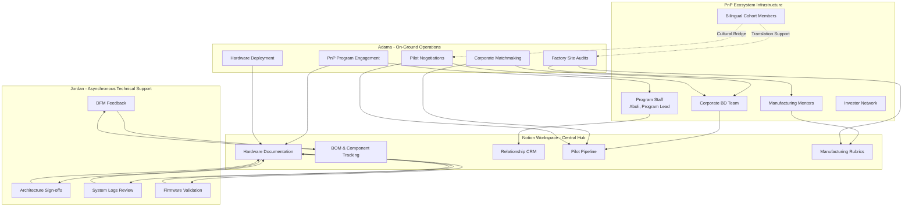
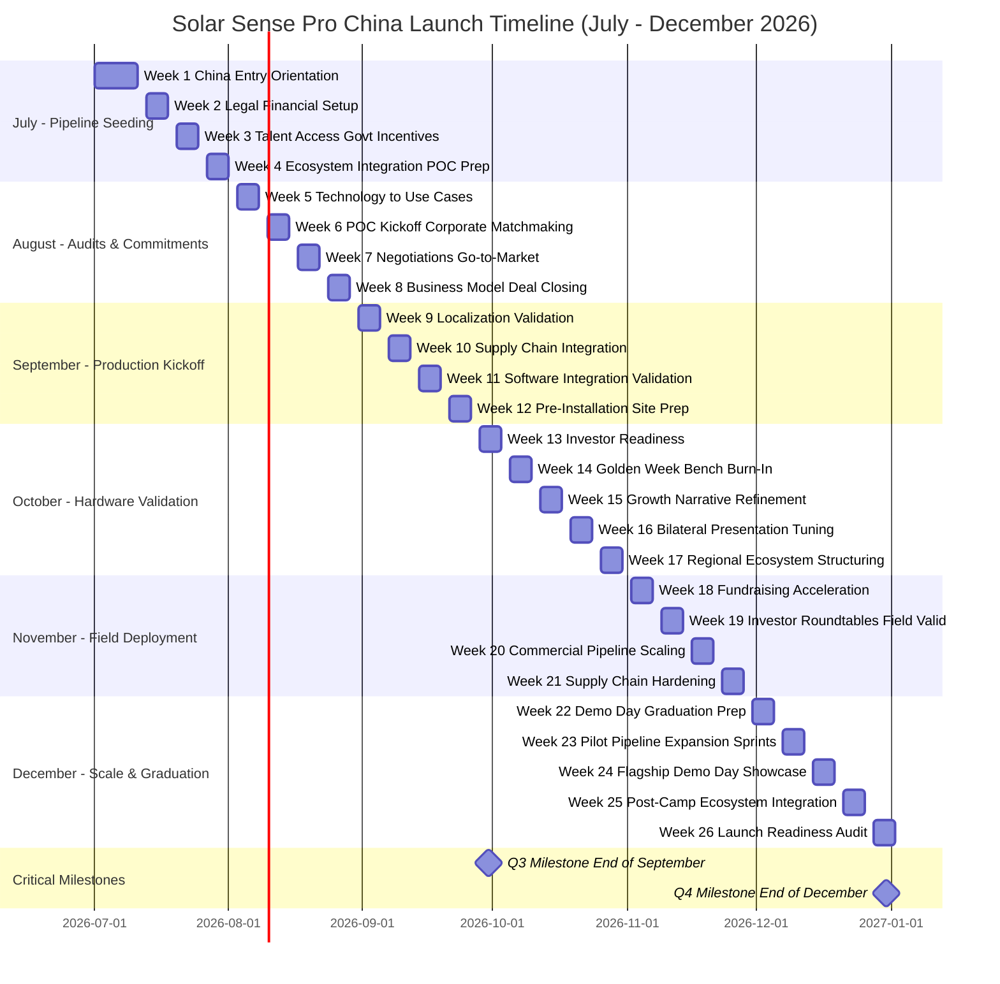
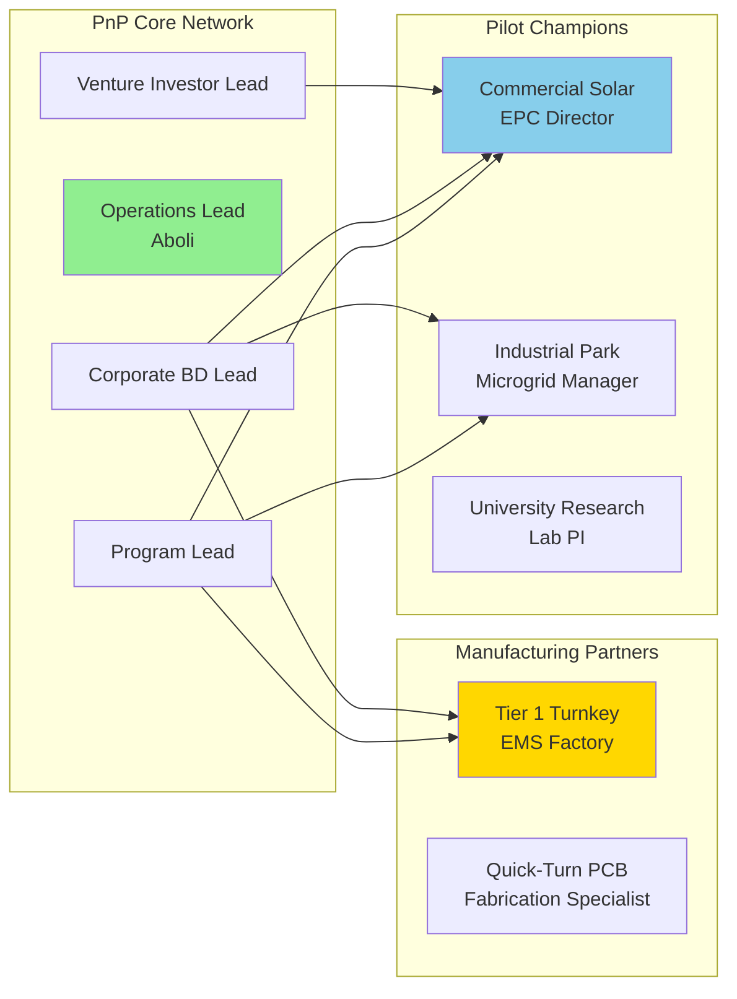

# Solar Sense Pro - China Launch Execution Plan

**Version:** Draft 1.0  
**Last Updated:** June 17, 2026  
**Program:** Plug and Play Cross-Border Acceleration Camp - Nantong Summer Cohort  
**Timeline:** July 2026 - December 2026 (6 months)  
**Status:** Pre-Launch Strategic Planning

---

## Executive Summary

This execution plan serves as the operational blueprint for Solar Sense Pro's China market entry, transforming the Plug and Play (PnP) Cross-Border Acceleration Camp from a curriculum-based program into an outsourced business development and manufacturing infrastructure.

**Core Objectives:**
- Secure 3+ pilot installation agreements with Chinese solar operators, EPCs, or research labs
- Establish a validated manufacturing partnership in the Yangtze River Delta
- Deploy at least 1 live Solar Sense Pro installation capturing real-world telemetry data
- Build a repeatable, scalable commercial and manufacturing framework

**Team Configuration:**
- **Adama:** On-ground founder in Nantong, China (non-Mandarin speaking)
- **Jordan:** US-based technical lead with asynchronous support via Notion

---

## Table of Contents

- [Executive Summary](#executive-summary)
- [Part 0: Strategic Macro Framing & Alignment](#part-0-strategic-macro-framing--alignment)
  - [Nantong Cross-Border Summer Cohort](#nantong-cross-border-summer-cohort)
  - [Team Strategy](#team-strategy)
  - [Strategic Operating Framework](#strategic-operating-framework)
- [Part 1: Execution Timeline](#part-1-execution-timeline)
  - [Monthly Objectives Overview](#monthly-objectives-overview)
  - [July 2026: Commercial Pipeline Seeding & Baseline Sourcing](#july-2026-commercial-pipeline-seeding--baseline-sourcing)
  - [August 2026: On-Site Manufacturing Audits & Pilot Commitment Closure](#august-2026-on-site-manufacturing-audits--pilot-commitment-closure)
  - [September 2026: Low-Volume Production Run & Site Readiness](#september-2026-low-volume-production-run--site-readiness)
  - [October 2026: Hardware Ingestion, Testing & Logistics Clearance](#october-2026-hardware-ingestion-testing--logistics-clearance)
  - [November 2026: Field Deployment & Active Data Acquisition](#november-2026-field-deployment--active-data-acquisition)
  - [December 2026: Pipeline Expansion & Strategic Hand-Off](#december-2026-pipeline-expansion--strategic-hand-off)
  - [Quarterly Milestones](#quarterly-milestones)
  - [6-Month Timeline Visualization](#6-month-timeline-visualization)
- [Part 2: Relationship Matrix](#part-2-relationship-matrix)
  - [Relationship Network Overview](#relationship-network-overview)
  - [Plug and Play Core Network](#plug-and-play-core-network)
  - [Verified Manufacturing Partners](#verified-manufacturing-partners)
  - [Target Pilot Champions & Customers](#target-pilot-champions--customers)
- [Part 3: Launch Readiness Checklist](#part-3-launch-readiness-checklist)
  - [Readiness Scorecard](#readiness-scorecard)
  - [Active Pilot & Field Operations State](#active-pilot--field-operations-state)
  - [Validated Manufacturing & Supply Chain Readiness](#validated-manufacturing--supply-chain-readiness)
  - [Strategic Network & Post-Program Autonomy](#strategic-network--post-program-autonomy)
- [Appendices](#appendices)
  - [Key Dates Calendar](#key-dates-calendar)
  - [Acronym Glossary](#acronym-glossary)
  - [Contact Quick Reference](#contact-quick-reference)

---

## Part 0: Strategic Macro Framing & Alignment

### Nantong Cross-Border Summer Cohort

Solar Sense Pro is participating in the Plug and Play Cross-Border Acceleration Camp - Nantong Summer Cohort. This program provides:

- Direct access to Chinese solar market stakeholders
- Manufacturing ecosystem connections in the Yangtze River Delta
- Corporate matchmaking with EPCs, operators, and industrial parks
- Government relations support for pilot site access
- Bilingual staff and cohort network for cultural bridge support

**Reference Document:** `Nantong Summer Cohort.pdf`

### Team Strategy

#### The PnP Operating System

Adama is a solo, non-Mandarin-speaking founder on the ground. He cannot waste time on cold outreach, open-web scraping, or administrative overhead. Every PnP roadshow, mentor session, and corporate matching track is treated as a **warm introduction engine** to secure pilot sites and validate manufacturing partners.

#### The Guardrail

Adama leverages PnP staff (such as Aboli) and bilingual cohort founders as cultural bridges and translation support to bypass the language barrier during high-stakes corporate and factory visits.

#### Asynchronous Balance

Jordan remains in the US on a tight time budget. Instead of running daily micro-alignment meetings, Jordan's technical expertise is preserved for asynchronous architectural sign-offs, DFM feedback, and system logs evaluation, all managed via a lean Notion workspace.

### Strategic Operating Framework

**Key Principles:**

1. **Warm Introductions Only:** Every relationship is sourced through PnP networks, not cold outreach
2. **Translation as Infrastructure:** Bilingual support is treated as essential operational infrastructure
3. **Asynchronous by Default:** Jordan provides technical support via documented reviews, not synchronous meetings
4. **Notion as Operating System:** All knowledge, decisions, and handoffs flow through the Notion workspace

[Back to Top](#table-of-contents)

---

## Part 1: Execution Timeline

### Monthly Objectives Overview

| Month | Primary Focus | Pilot Acquisition Goal | Manufacturing Goal | Critical Deliverable |
|-------|--------------|------------------------|-------------------|---------------------|
| **July 2026** | Commercial Pipeline Seeding & Baseline Sourcing | Build pipeline of 15 target partners | Source pool of 5 EMS partners | Operational Notion workspace |
| **August 2026** | On-Site Manufacturing Audits & Pilot Commitment Closure | Secure 3 formal pilot agreements | Narrow to 2 top candidates, conduct audits | Signed pilot deployment contract |
| **September 2026** | Low-Volume Production Run & Site Readiness | Finalize site preparation parameters | Kick off 10-50 unit production run | Hardware bring-up guide |
| **October 2026** | Hardware Ingestion, Testing & Logistics Clearance | Pre-installation inspections | Ingest and validate 10-50 unit batch | Production batch validated |
| **November 2026** | Field Deployment & Active Data Acquisition | Deploy live installation | Lock pricing for 100-500+ units | Live telemetry stream active |
| **December 2026** | Pipeline Expansion & Strategic Hand-Off | Secure 2 additional Q1 2027 pilots | Freeze production playbook | Launch readiness certified |

---

### July 2026: Commercial Pipeline Seeding & Baseline Sourcing

**Phase 1: Land & Launch — Pipeline Seeding & Sourcing**

#### Month Overview

**Pilot Acquisition:**
- Convert the PnP Orientation, Kickoff Roadshow, and Shanghai Business Trip into a high-yield funnel
- Build a pipeline of **15** target partners (solar EPCs, industrial parks, and university labs)

**Manufacturing Sourcing:**
- Engage PnP manufacturing mentors to source a curated pool of 5 turnkey Electronic Manufacturing Service (EMS) partners in the Yangtze River Delta capable of multi-tier scaling (10 to 1,000+ units)

**Jordan Transfer:**
- Establish the asynchronous Notion baseline
- Jordan archives clear hardware boundary conditions, power rail criteria, and flashing procedures to allow Adama to run independent supplier evaluations

---

#### Week 1: July 1-10, 2026

**Program Topic:** China Entry & Founder Orientation

| **Dimension** | **Details** |
|---------------|-------------|
| **Week Dates** | July 1-10, 2026 |
| **Priority Level** | Critical |
| **Estimated Hours** | Adama: 32 hrs | Jordan: 4 hrs |

**Technical Track:**
- Stand up the streamlined Notion workspace
- Index all hardware schematics, pin configurations, and firmware boundaries for the current Solar Sense Pro design

**Relationship Track:**
- Onboard with Aboli and the PnP Program Lead
- Pitch the Solar Sense Pro target profile to the PnP team during 1-on-1 sessions to seed the upcoming matching pipeline
- Attend the Kickoff Roadshow to connect with NETDA, NID, and NHIZ officials

**Jordan Track:**
- Weekly alignment check: baseline the Notion task parameters, confirm communication windows, and finalize document handling rules

**Deliverables:**
- Operational Notion workspace layout
- Completed PnP onboarding profiling sheets

**Success Metrics:**
- ✓ 100% of core technical baseline documents indexed
- ✓ Early target requirements delivered to the PnP program lead

---

#### Week 2: July 13-17, 2026

**Program Topic:** Legal, Financial & Operational Setup

| **Dimension** | **Details** |
|---------------|-------------|
| **Week Dates** | July 13-17, 2026 |
| **Priority Level** | High |
| **Estimated Hours** | Adama: 40 hrs (including Shanghai travel) | Jordan: 3 hrs |

**Technical Track:**
- Map the hardware Bill of Materials (BOM) to cross-reference component availability via local distributors
- Highlight parts vulnerable to localized lead times

**Relationship Track:**
- Attend banking and taxation workshops to clear regulatory operational steps
- Participate in Shanghai Business Trip to network with Yangtze River Delta innovation stakeholders and source early manufacturing leads

**Jordan Track:**
- Asynchronous review: check localized component recommendations and sign off on alternative part tolerances via Notion

**Deliverables:**
- Preliminary localized component tracking database
- Local bank setup documents

**Success Metrics:**
- ✓ Corporate banking infrastructure activated
- ✓ Initial list of 3 potential regional component distributors established

---

#### Week 3: July 20-24, 2026

**Program Topic:** Talent Access & Government Incentives

| **Dimension** | **Details** |
|---------------|-------------|
| **Week Dates** | July 20-24, 2026 |
| **Priority Level** | Critical |
| **Estimated Hours** | Adama: 30 hrs | Jordan: 5 hrs |

**Technical Track:**
- Group the localized BOM components into specific sourcing packages (PCBA, mechanical enclosure, terminal connectors)
- Prepare clean RFQ templates

**Relationship Track:**
- Interface with Technology Department officials during PnP grant workshops to assess regional test-bed availability
- Ask the PnP Corporate BD Lead for a list of 5 small-to-mid-scale turnkey EMS providers located in the Jiangsu/Yangtze River Delta region

**Jordan Track:**
- Design review: check connector footprints and mechanical tolerances to ensure compatibility with standard Chinese laboratory and industrial solar infrastructure

**Deliverables:**
- Production-ready RFQ package drafted in English and Chinese
- Policy-matching log in Notion

**Success Metrics:**
- ✓ 5 regional EMS manufacturing targets identified and logged with clear warm-introduction paths via PnP

---

#### Week 4: July 27-31, 2026

**Program Topic:** Ecosystem Integration & POC Preparation

| **Dimension** | **Details** |
|---------------|-------------|
| **Week Dates** | July 27-31, 2026 |
| **Priority Level** | High |
| **Estimated Hours** | Adama: 42 hrs (including Wenzhou travel) | Jordan: 4 hrs |

**Technical Track:**
- Configure firmware data-handling parameters to allow for complete offline operation or direct local server communication
- Bypass external cloud dependencies for operation inside the Great Firewall

**Relationship Track:**
- Use the guided city tour and Wenzhou Business Trip to engage local business stakeholders
- Work with PnP advisors and bilingual cohort members to adapt the Solar Sense Pro presentation deck for Chinese commercial buyers (EPCs, developers, and operators)

**Jordan Track:**
- Code review: verify the firmware's offline telemetry storage buffer sizes to prevent data loss inside the Great Firewall

**Deliverables:**
- Localized dual-language pitch deck focused on commercial validation
- Updated offline firmware branch

**Success Metrics:**
- ✓ Commercial pitch presentation vetted by at least one native-speaking PnP advisor or cohort peer

**July 2026 Summary:** By month end, Solar Sense Pro should have a fully operational Notion workspace, a pipeline of 15 target partners, and 5 identified EMS manufacturing candidates.

[Back to Top](#table-of-contents)

---

### August 2026: On-Site Manufacturing Audits & Pilot Commitment Closure

**Phase 2: Market Entry — Audits & Commitments**

#### Month Overview

**Pilot Acquisition:**
- Leverage the PnP POC Kickoff, Corporate Matchmaking, and Wenzhou/regional business trips to run face-to-face pitches
- Secure at least 3 formal, zero-cost pilot installation agreements with data-sharing rights

**Manufacturing Sourcing:**
- Narrow the supplier pool down to 2 top candidates
- Adama executes 2 on-site factory floor audits with PnP translation support to verify quality controls, trace lines, and multi-tier pricing models

**Jordan Transfer:**
- Jordan reviews factory DFM capabilities asynchronously to clear technical blockers prior to pilot assembly

---

#### Week 5: August 3-7, 2026

**Program Topic:** From Technology to Real Use Cases

| **Dimension** | **Details** |
|---------------|-------------|
| **Week Dates** | August 3-7, 2026 |
| **Priority Level** | Critical |
| **Estimated Hours** | Adama: 34 hrs | Jordan: 4 hrs |

**Technical Track:**
- Standardize an engineering evaluation matrix in Notion to grade potential manufacturing partners across quality, scale flexibility, and component access

**Relationship Track:**
- Attend the Market Entry and IP Workshops
- Present the finalized RFQ package to the PnP Corporate BD team to initiate warm supplier introductions
- Screen the PnP network for local solar EPC firms, commercial operators, and research labs

**Jordan Track:**
- Monthly review: evaluate July's pipeline progress, adjust target timelines, and approve the initial hardware fabrication budget

**Deliverables:**
- Finalized EMS Evaluation Rubric
- Active Pilot Target Pipeline tracking sheet populated with 10+ entry rows in Notion

**Success Metrics:**
- ✓ 3 target EMS partners engaged with active RFQs
- ✓ 5 qualified pilot target organizations entered into the CRM funnel

---

#### Week 6: August 10-14, 2026

**Program Topic:** POC Kickoff & Corporate Matchmaking

| **Dimension** | **Details** |
|---------------|-------------|
| **Week Dates** | August 10-14, 2026 |
| **Priority Level** | Critical |
| **Estimated Hours** | Adama: 45 hrs | Jordan: 5 hrs |

**Technical Track:**
- Consolidate initial quotation responses, lead-time estimates, and component flags returned by the engaged manufacturing suppliers

**Relationship Track:**
- Pitch Solar Sense Pro at the flagship matchmaking event to corporate energy partners, industrial park representatives, and regional developers
- Conduct private, 1-on-1 closed-door matchmaking sessions to source pilot sites

**Jordan Track:**
- Asynchronous technical feedback: review manufacturing feedback and address vendor component substitution concerns via Notion

**Deliverables:**
- Matchmaking interaction summary
- Initial manufacturing quotation comparison ledger in Notion

**Success Metrics:**
- ✓ At least 3 face-to-face pilot site leads advanced to formal proposal stages
- ✓ 2 target EMS partners shortlisted for physical site audits

---

#### Week 7: August 17-21, 2026

**Program Topic:** Negotiations, Go-to-Market & Pilot Testing

| **Dimension** | **Details** |
|---------------|-------------|
| **Week Dates** | August 17-21, 2026 |
| **Priority Level** | High |
| **Estimated Hours** | Adama: 38 hrs | Jordan: 3 hrs |

**Technical Track:**
- Prepare a localized field testing protocol document mapping out safety parameters, mounting constraints, and grounding verifications for pilot installations

**Relationship Track:**
- Run active negotiations with shortlisted pilot partners, utilizing PnP bilingual support to define the scope of the field deployment
- Join the regional industrial business trip to explore broader commercial solar operator networks

**Jordan Track:**
- Asynchronous review: check safety and shutdown response parameters against regional electrical standards

**Deliverables:**
- Standardized Field Pilot Agreement template
- Localized Installation Safety Checklist

**Success Metrics:**
- ✓ 2 formal pilot deployment agreements advanced to the final signature phase with regional commercial or academic partners

---

#### Week 8: August 24-28, 2026

**Program Topic:** Business Model Validation & Deal Closing

| **Dimension** | **Details** |
|---------------|-------------|
| **Week Dates** | August 24-28, 2026 |
| **Priority Level** | Critical |
| **Estimated Hours** | Adama: 46 hrs (includes full-day factory visit) | Jordan: 6 hrs |

**Technical Track:**
- Finalize structural layout optimizations for Solar Sense Pro based on the physical terminal box parameters observed in regional corporate partner data sheets

**Relationship Track:**
- Attend business model validation sessions to refine localized pricing structures
- Finalize partnership terms and secure signed deployment contracts with primary pilot hosts
- Run an on-site factory audit at the highest-rated EMS candidate facility (Full-Day Site Visit)

**Jordan Track:**
- Technical sign-off: execute the definitive design freeze for the 10 to 50 unit low-volume production batch

**Deliverables:**
- Signed Pilot Deployment Contract (Minimum of 1, Target of 2+)
- Completed EMS Site Audit Report

**Success Metrics:**
- ✓ At least 1 binding pilot agreement signed with an operator, EPC, or lab
- ✓ EMS partner validated and cleared for assembly

**August 2026 Summary:** By month end, Solar Sense Pro should have at least 3 signed pilot agreements and 2 audited EMS manufacturing candidates.

[Back to Top](#table-of-contents)

---

### September 2026: Low-Volume Production Run & Site Readiness

**Phase 3: Manufacturing Kickoff & Site Readiness**

#### Month Overview

**Pilot Acquisition:**
- Finalize site preparation parameters with committed pilot hosts (electrical connections, communication layout, data pathways inside the Great Firewall)

**Manufacturing Sourcing:**
- Contract the chosen EMS partner
- Kick off a low-volume run of 10 to 50 units of Solar Sense Pro hardware

**Jordan Transfer:**
- Jordan delivers a localized testing and bring-up checklist via Notion, allowing Adama to handle initial hardware validation independently on the ground

---

#### Week 9: August 31 - September 4, 2026

**Program Topic:** Month 3 Transition — Localization & Validation

| **Dimension** | **Details** |
|---------------|-------------|
| **Week Dates** | August 31 - September 4, 2026 |
| **Priority Level** | Critical |
| **Estimated Hours** | Adama: 35 hrs | Jordan: 5 hrs |

**Technical Track:**
- Deliver production Gerber files, localized BOM components, and assembly specifications to the contracted EMS partner
- Kick off the 10 to 50 unit manufacturing run

**Relationship Track:**
- Coordinate with the signed pilot host's engineering point person to map out physical mounting constraints and data-access parameters at the deployment site

**Jordan Track:**
- Asynchronous tracking: monitor the factory floor's incoming component quality logs and design-for-assembly (DFA) inquiries

**Deliverables:**
- Open purchase order for the 10 to 50 unit production batch
- Site Readiness Log in Notion

**Success Metrics:**
- ✓ Manufacturing run approved and scheduled by the EMS partner
- ✓ Site parameters mapped

---

#### Week 10: September 7-11, 2026

**Program Topic:** Deep POC Execution — Supply Chain Integration

| **Dimension** | **Details** |
|---------------|-------------|
| **Week Dates** | September 7-11, 2026 |
| **Priority Level** | Medium |
| **Estimated Hours** | Adama: 28 hrs | Jordan: 8 hrs |

**Technical Track:**
- Build a localized hardware bring-up and calibration checklist in Notion covering power rail verification, sensor gain adjustment, and flashing routines

**Relationship Track:**
- Maintain regular contact with the EMS facility production manager to monitor progress and build a long-term supply relationship

**Jordan Track:**
- Hardware bring-up documentation: create a step-by-step video guide showing how to flash, calibrate, and test the platform using basic bench gear

**Deliverables:**
- Localized Hardware Bring-up & Verification Guide logged in Notion

**Success Metrics:**
- ✓ 100% of the validation procedures documented, allowing Adama to execute testing independently at the PnP hub

---

#### Week 11: September 14-18, 2026

**Program Topic:** Localized Software & Integration Validation

| **Dimension** | **Details** |
|---------------|-------------|
| **Week Dates** | September 14-18, 2026 |
| **Priority Level** | High |
| **Estimated Hours** | Adama: 32 hrs | Jordan: 4 hrs |

**Technical Track:**
- Configure localized user interface dashboards and test data telemetry pipelines inside the Great Firewall
- Verify error-free communication with local receivers

**Relationship Track:**
- Update the PnP program lead on manufacturing progress to clear space within the hub's lab testing benches for incoming hardware

**Jordan Track:**
- Firmware review: check the integration of localized data telemetry profiles and calibration math variables

**Deliverables:**
- Validated local UI dashboard
- Active data ingestion channel on a local server instance

**Success Metrics:**
- ✓ Software telemetry verified to transmit data points within local network environments without dropped packets

---

#### Week 12: September 21-25, 2026

**Program Topic:** Pre-Installation Site Preparation

| **Dimension** | **Details** |
|---------------|-------------|
| **Week Dates** | September 21-25, 2026 |
| **Priority Level** | High |
| **Estimated Hours** | Adama: 36 hrs (includes full-day site visit) | Jordan: 5 hrs |

**Technical Track:**
- Formulate the physical installation kit list (enclosures, outdoor-rated cable extensions, quick-disconnect couplings, terminal blocks) to match the selected pilot site

**Relationship Track:**
- Execute a physical walk-through and site parameter check at the confirmed pilot installation yard (Full-Day Site Visit)
- Coordinate directly with the site team to finalize the deployment window

**Jordan Track:**
- Monthly review: evaluate September's low-volume production metrics, check the Q3 milestone completion state, and authorize October field integration assets

**Deliverables:**
- Q3 Strategic Milestone Performance Report
- Signed Site Readiness Sign-off Sheet

**Success Metrics:**
- ✓ Physical pilot installation site verified as structurally and electrically ready for hardware integration

**September 2026 Summary:** By month end, Solar Sense Pro should have a contracted EMS partner with production underway and pilot sites fully prepared for hardware deployment.

[Back to Top](#table-of-contents)

---

### October 2026: Hardware Ingestion, Testing & Logistics Clearance

**Phase 4: Hardware Ingestion & Bench Validation**

#### Month Overview

**Pilot Acquisition:**
- Conduct pre-installation inspections at the first target pilot site (commercial roof, university test-bed, or industrial microgrid)

**Manufacturing Sourcing:**
- Ingest the 10 to 50 unit production batch
- Run continuous electrical bench validation and burn-in testing at the PnP hub

**Jordan Transfer:**
- Jordan reviews hardware validation logs asynchronously, providing remote troubleshooting steps only if structural component anomalies occur

---

#### Week 13: September 28 - October 2, 2026

**Program Topic:** Month 4 Transition — Investor Readiness

| **Dimension** | **Details** |
|---------------|-------------|
| **Week Dates** | September 28 - October 2, 2026 |
| **Priority Level** | Critical |
| **Estimated Hours** | Adama: 40 hrs | Jordan: 4 hrs |

**Technical Track:**
- Ingest the physical 10 to 50 unit production batch from the EMS partner
- Unbox, catalog, and log the physical condition of all boards within the central Notion inventory module

**Relationship Track:**
- Invite the EMS production manager and senior engineers for a feedback review to debrief on assembly challenges
- Discuss upcoming 100 to 500 unit scaling dynamics

**Jordan Track:**
- Asynchronous support: review initial unboxing photography and stand by to cross-check any manufacturing quality anomalies

**Deliverables:**
- Production Batch Ingestion Log
- Initial Manufacturing Yield Summary

**Success Metrics:**
- ✓ 100% of manufactured units cataloged with serial numbers
- ✓ Manufacturing yield metrics documented in Notion

---

#### Week 14: October 5-9, 2026

**Program Topic:** National Holiday Week (Golden Week) — Internal Validation & Bench Burn-In

| **Dimension** | **Details** |
|---------------|-------------|
| **Week Dates** | October 5-9, 2026 (Golden Week) |
| **Priority Level** | Critical |
| **Estimated Hours** | Adama: 30 hrs | Jordan: 8 hrs |

**Technical Track:**
- Set up a multi-unit testing array at the PnP hub workspace
- Execute the localized bring-up checklist across the batch: flash firmware, check power rails, and verify base current/voltage sensing operation

**Relationship Track:**
- None (National Holiday closures across external offices and factories)
- Focus entirely on internal technical execution

**Jordan Track:**
- Active asynchronous engineering support: audit early telemetry calibration logs uploaded by Adama
- Provide remote debugging instructions for outlier boards

**Deliverables:**
- Batch Functional Testing Database
- Serialized calibration logs

**Success Metrics:**
- ✓ At least 10 individual hardware units fully flashed, calibrated, and functionally validated on the test bench

---

#### Week 15: October 12-16, 2026

**Program Topic:** Investor Materials & Growth Narrative Refinement

| **Dimension** | **Details** |
|---------------|-------------|
| **Week Dates** | October 12-16, 2026 |
| **Priority Level** | High |
| **Estimated Hours** | Adama: 34 hrs | Jordan: 4 hrs |

**Technical Track:**
- Subject the verified hardware batch to a continuous 72-hour automated load burn-in run to trigger and filter out infant mortality failures before field deployment

**Relationship Track:**
- Meet with PnP financial advisors to structure a multi-tier manufacturing economic roadmap tailored for commercial investors

**Jordan Track:**
- Asynchronous review: analyze continuous long-run sensor data streams to identify parametric drift or thermal performance issues under load

**Deliverables:**
- Multi-Tier Economic Strategy Model (covering cost metrics across 10, 100, and 1,000+ unit runs)
- Hardware Burn-In Stability Report

**Success Metrics:**
- ✓ At least 5 units completely clear the continuous stress testing run with zero component failures, certified ready for deployment

---

#### Week 16: October 19-23, 2026

**Program Topic:** Bilateral Presentation Tuning

| **Dimension** | **Details** |
|---------------|-------------|
| **Week Dates** | October 19-23, 2026 |
| **Priority Level** | High |
| **Estimated Hours** | Adama: 32 hrs | Jordan: 3 hrs |

**Technical Track:**
- Assemble complete, outdoor-rated Pilot Installation Kits, enclosing verified boards into protective housings paired with matched terminal cabling

**Relationship Track:**
- Work alongside native-speaking cohort partners and PnP advisors to adapt the commercial growth narrative into a clear, data-backed pitch presentation

**Jordan Track:**
- Narrative alignment: confirm that the technical performance boundaries, safety ratings, and diagnostic accuracy values shown in the deck match verified laboratory test logs

**Deliverables:**
- Finalized Dual-Language Commercial Pitch Presentation
- Complete Pilot Installation Kits staged for transit

**Success Metrics:**
- ✓ Pitch presentation cleared of language anomalies by native-speaking industry peers
- ✓ Kits packed

---

#### Week 17: October 26-30, 2026

**Program Topic:** Regional Ecosystem Structuring

| **Dimension** | **Details** |
|---------------|-------------|
| **Week Dates** | October 26-30, 2026 |
| **Priority Level** | Critical |
| **Estimated Hours** | Adama: 35 hrs | Jordan: 5 hrs |

**Technical Track:**
- Run a pre-deployment loop check on the kitted pilot hardware to confirm the firmware's offline data-logging fail-safes are active

**Relationship Track:**
- Connect with local incubator or industrial park managers via PnP introductions to evaluate post-program landing opportunities
- Present the economic roadmap to the PnP Investor Lead for feedback

**Jordan Track:**
- Monthly review: evaluate October's hardware validation runs, finalize November's installation scheduling, and approve on-site integration configurations

**Deliverables:**
- Monthly Performance Variance Audit
- Finalized Field Deployment Work Plan

**Success Metrics:**
- ✓ Final approval secured from the pilot site team for the upcoming field installation window

**October 2026 Summary:** By month end, Solar Sense Pro should have 10-50 validated hardware units and complete pilot installation kits ready for field deployment.

[Back to Top](#table-of-contents)

---

### November 2026: Field Deployment & Active Data Acquisition

**Phase 5: Field Deployment & Active Operations**

#### Month Overview

**Pilot Acquisition:**
- Deploy Solar Sense Pro hardware into at least 1 active Chinese pilot installation site
- Establish live telemetry ingestion inside the Great Firewall

**Manufacturing Sourcing:**
- Lock in comprehensive pricing structures and manufacturing risk matrices with the primary EMS provider for 100 to 500 unit and 1,000+ unit commercial scales

**Jordan Transfer:**
- Jordan analyzes initial field data sets via the Notion workspace to verify sensor accuracy under real-world operating loads

---

#### Week 18: November 2-6, 2026

**Program Topic:** Month 5 Transition — Fundraising Acceleration

| **Dimension** | **Details** |
|---------------|-------------|
| **Week Dates** | November 2-6, 2026 |
| **Priority Level** | Critical |
| **Estimated Hours** | Adama: 45 hrs (includes full-day deployment) | Jordan: 6 hrs |

**Technical Track:**
- Transport hardware kits to the primary deployment yard
- Install Solar Sense Pro onto the active photovoltaic infrastructure following the localized installation checklist (Full-Day On-Site Deployment)

**Relationship Track:**
- Execute the physical installation in cooperation with the host site's operations staff, building deep rapport with the field engineering crew
- Participate in initial PnP investor roundtable events

**Jordan Track:**
- Standby remote technical coverage: remain online during the installation window to review early over-the-air parameter checks

**Deliverables:**
- Field Installation Log
- Active live site monitoring stream initialized in Notion

**Success Metrics:**
- ✓ At least 1 Solar Sense Pro monitoring node physically mounted, electrically integrated, and actively running on a live system in China

---

#### Week 19: November 9-13, 2026

**Program Topic:** Closed-Door Investor Roundtables & Field Validation

| **Dimension** | **Details** |
|---------------|-------------|
| **Week Dates** | November 9-13, 2026 |
| **Priority Level** | High |
| **Estimated Hours** | Adama: 34 hrs | Jordan: 5 hrs |

**Technical Track:**
- Monitor incoming telemetry streams from the live site (current, voltage, temperature, diagnostic flags)
- Cross-reference the data points against local weather and system tracking metrics

**Relationship Track:**
- Pitch Solar Sense Pro's real-world field validation metrics to venture capital partners and investment representatives during private PnP roundtables

**Jordan Track:**
- Asynchronous telemetry audit: run performance evaluations on the live field data to verify current/voltage tracking precision under variable environmental conditions

**Deliverables:**
- Initial Field Telemetry Analysis Report
- Localized investment interest tracker

**Success Metrics:**
- ✓ 5 continuous days of clean data ingestion captured and archived inside the Notion platform

---

#### Week 20: November 16-20, 2026

**Program Topic:** Commercial Pipeline Scaling

| **Dimension** | **Details** |
|---------------|-------------|
| **Week Dates** | November 16-20, 2026 |
| **Priority Level** | Critical |
| **Estimated Hours** | Adama: 36 hrs | Jordan: 4 hrs |

**Technical Track:**
- Implement localized dashboard interface refinements based on direct feedback and visibility choices requested by the active pilot host's engineering team

**Relationship Track:**
- Leverage the active, data-producing China site installation as live leverage
- Invite secondary pipeline prospects (EPCs, developers) to review the live dashboard data during follow-up meetings

**Jordan Track:**
- Software optimization: refine analytics data parsing algorithms to optimize memory consumption on the local server container

**Deliverables:**
- Refined User Dashboard (v1.1)
- Secondary pilot proposal letters dispatched

**Success Metrics:**
- ✓ Telemetry data successfully packaged into active sales collateral to drive pipeline conversions

---

#### Week 21: November 23-27, 2026

**Program Topic:** Supply Chain Hardening & Scale Contract Optimization

| **Dimension** | **Details** |
|---------------|-------------|
| **Week Dates** | November 23-27, 2026 |
| **Priority Level** | High |
| **Estimated Hours** | Adama: 38 hrs | Jordan: 6 hrs |

**Technical Track:**
- Refine the hardware design documentation to incorporate assembly insights from October's run
- Create a finalized package optimized for larger-scale production

**Relationship Track:**
- Convene with the primary EMS provider to negotiate structured pricing, lead-time guarantees, and component buffers across 100 to 500 unit and 1,000+ unit commercial scales

**Jordan Track:**
- Monthly review: evaluate live system data, analyze EMS scale pricing tiers, and sign off on the definitive production design files

**Deliverables:**
- Finalized High-Volume Production Design Archive
- Validated Scale Pricing Contract Agreement draft

**Success Metrics:**
- ✓ Written manufacturing pricing structures locked and documented for multi-tier scaling paths

**November 2026 Summary:** By month end, Solar Sense Pro should have at least 1 live installation capturing real-world data and locked pricing for commercial-scale manufacturing.

[Back to Top](#table-of-contents)

---

### December 2026: Pipeline Expansion & Strategic Hand-Off

**Phase 6: Scale, Showcase & Graduation**

#### Month Overview

**Pilot Acquisition:**
- Collect real-world field validation performance data
- Leverage this early proof-of-concept data during the final PnP Demo Day to attract 2 additional pilot commitments for Q1 2027 expansion

**Manufacturing Sourcing:**
- Freeze the production playbook and secure a long-term contract framework with the validated manufacturing partner

**Jordan Transfer:**
- Conduct the final launch readiness audit
- Transition the local operation into an autonomous, repeatable execution state

---

#### Week 22: November 30 - December 4, 2026

**Program Topic:** Month 6 Transition — Demo Day & Graduation Prep

| **Dimension** | **Details** |
|---------------|-------------|
| **Week Dates** | November 30 - December 4, 2026 |
| **Priority Level** | High |
| **Estimated Hours** | Adama: 35 hrs | Jordan: 4 hrs |

**Technical Track:**
- Compile a comprehensive field performance report covering the first 3 weeks of active live-site operations
- Detail energy safety, diagnostic accuracy, and hardware reliability

**Relationship Track:**
- Work alongside PnP presentation advisors to integrate the live field data and multi-tier manufacturing agreements into a high-impact Demo Day pitch

**Jordan Track:**
- Data verification: audit the cumulative field telemetry records to verify the platform's diagnostic performance claims

**Deliverables:**
- Solar Sense Pro Field Performance Report
- Finalized Demo Day presentation asset files

**Success Metrics:**
- ✓ 21 days of continuous, uninterrupted field monitoring data captured and compiled into the commercial presentation

---

#### Week 23: December 7-11, 2026

**Program Topic:** Pilot Pipeline Expansion Sprints

| **Dimension** | **Details** |
|---------------|-------------|
| **Week Dates** | December 7-11, 2026 |
| **Priority Level** | High |
| **Estimated Hours** | Adama: 38 hrs | Jordan: 3 hrs |

**Technical Track:**
- Maintain data monitoring on the primary pilot node while packaging a second hardware kit for a secondary expansion deployment

**Relationship Track:**
- Execute follow-up verification pitches to secondary pipeline candidates
- Use the field performance report to convert leads into committed Q1 2027 pilot sites

**Jordan Track:**
- Asynchronous technical oversight: review secondary site installation layouts and confirm system parameter limits

**Deliverables:**
- Pipeline Conversion Dashboard
- Updated Q1 2027 Deployment Strategy roadmap

**Success Metrics:**
- ✓ At least 2 additional qualified pilot organizations committed to hardware integration for Q1 2027

---

#### Week 24: December 14-18, 2026

**Program Topic:** Flagship Demo Day Showcase

| **Dimension** | **Details** |
|---------------|-------------|
| **Week Dates** | December 14-18, 2026 |
| **Priority Level** | Critical |
| **Estimated Hours** | Adama: 40 hrs | Jordan: 4 hrs |

**Technical Track:**
- Ensure stable, live, real-time data connectivity between the active field installation site and the presentation screens at the PnP graduation venue

**Relationship Track:**
- Present Solar Sense Pro at the final PnP Demo Day to cross-border investors, corporate energy partners, and government leaders
- Collect and organize follow-up contacts during post-presentation networking sessions

**Jordan Track:**
- Asynchronous infrastructure support: monitor server performance during live demo presentation windows

**Deliverables:**
- Executed Demo Day Presentation
- Centralized Lead Tracking Database populated with graduation contacts

**Success Metrics:**
- ✓ High-impact pitch delivery
- ✓ At least 3 high-value investor or corporate follow-up requests secured and logged

---

#### Week 25: December 21-25, 2026

**Program Topic:** Post-Camp Ecosystem Integration & Operational Hand-off

| **Dimension** | **Details** |
|---------------|-------------|
| **Week Dates** | December 21-25, 2026 |
| **Priority Level** | High |
| **Estimated Hours** | Adama: 30 hrs | Jordan: 5 hrs |

**Technical Track:**
- Package all regional component supply logs, factory test parameters, and firmware deployment steps into a repeatable localized manufacturing playbook in Notion

**Relationship Track:**
- Distribute formal follow-up messages and thank-you notes to all key program contacts, advisors, the EMS team, and pilot hosts to cement the local support network

**Jordan Track:**
- Technical handover review: audit the completed manufacturing playbook to ensure clear documentation of all specialized production knowledge

**Deliverables:**
- Localized Manufacturing Playbook
- Post-Camp Ecosystem Network Register

**Success Metrics:**
- ✓ 100% of the active supplier and ecosystem paths documented with role-based responsibilities in Notion

---

#### Week 26: December 28 - January 1, 2027

**Program Topic:** Definitive Launch Readiness Audit & Sign-Off

| **Dimension** | **Details** |
|---------------|-------------|
| **Week Dates** | December 28, 2026 - January 1, 2027 |
| **Priority Level** | Critical |
| **Estimated Hours** | Adama: 24 hrs | Jordan: 4 hrs |

**Technical Track:**
- Run a comprehensive performance check across the live pilot system to verify steady-state sensor metrics and safe operation under load

**Relationship Track:**
- Confirm post-program communication cadences with local pilot hosts, EMS partners, and advisory contacts to maintain momentum into Q1 2027

**Jordan Track:**
- Definitive Launch Readiness Sign-off: run a final evaluation of the Notion workspace, review manufacturing economics, and transition day-to-day project execution entirely to Adama's localized framework

**Deliverables:**
- Completed Solar Sense Pro Launch Readiness Checklist
- Signed Q4 Milestone Performance Document

**Success Metrics:**
- ✓ 100% completion across all operational tracks, establishing a credible, validated market-ready position

**December 2026 Summary:** By month end, Solar Sense Pro should have completed Demo Day, secured 2 additional Q1 2027 pilot commitments, and achieved full launch readiness certification.

[Back to Top](#table-of-contents)

---

### Quarterly Milestones

#### Milestone 1: Q3 2026 (End of September)
**Commercial Commitments & Production Kickoff**

| **Category** | **Target** | **Success Criteria** |
|-------------|-----------|---------------------|
| Pilot Pipeline | 15+ target partners | Diverse mix of EPCs, operators, and labs |
| Signed Agreements | 3+ pilot deployments | At least 3 formal, zero-cost installation agreements with data-sharing rights |
| Manufacturing Partner | 1 audited EMS provider | Primary Yangtze River Delta EMS partner audited, selected, and contracted |
| Production Run | 10-50 units initiated | Components cleared for regional sourcing |
| Technical Infrastructure | Notion workspace operational | All hardware documentation indexed and accessible |

---

#### Milestone 2: Q4 2026 (End of December)
**Live Field Operations & Scale Readiness**

| **Category** | **Target** | **Success Criteria** |
|-------------|-----------|---------------------|
| Live Installation | 1+ active deployment | Solar Sense Pro fully operational in China, capturing high-resolution telemetry inside the Great Firewall |
| Field Data | 21+ days continuous | Validated performance data compiled into commercial sales collateral |
| Manufacturing Economics | Multi-tier pricing locked | Verified pricing matrix for 10, 100, and 1,000+ unit scales signed by EMS partner |
| Pipeline Expansion | 2+ Q1 2027 pilots secured | Additional committed pilot organizations for Q1 2027 deployment |
| Post-Program Network | Ecosystem established | Active relationships with PnP advisors, factory managers, and pilot coordinators |
| Launch Readiness | 100% certification | All readiness checklist items complete, positioning Adama to scale independently |

---

### 6-Month Timeline Visualization

**Total Program Duration:** 26 weeks (6 months)  
**Total Estimated Hours (Adama):** ~950 hours  
**Total Estimated Hours (Jordan):** ~120 hours  

[Back to Top](#table-of-contents)

---

## Part 2: Relationship Matrix

This database tracks the high-leverage connections required to maintain operations beyond the program. In compliance with data requirements, all unconfirmed entries use role-based placeholders linked to verifiable PnP tracks.

### Relationship Network Overview

**Legend:**
- Green: Named/Verified contacts
- Gold: Critical manufacturing partners
- Blue: Target pilot champions

---

### Plug and Play Core Network

| Role | Name | Organization | Why It Matters | Sourcing Path | Next Action | First Ask | Status |
|------|------|--------------|----------------|---------------|-------------|-----------|--------|
| **Program Lead** | TBD | Plug and Play China (Nantong Hub) | Connects the team to regional industrial parks, handles program evaluations, and acts as the primary link for ecosystem introductions | PnP intro | Execute 1-on-1 alignment session in Week 1 to detail pilot pipeline criteria | "Connect us with the corporate partnerships team to pinpoint regional solar EPCs and developers" | Intro pending |
| **Operations Lead** | Aboli | Plug and Play China | Manages local onboarding logistics, housing arrangements, local payment setups, and hub resource access | Named in inputs | Connect via WeChat to finalize apartment contracts and secure desk space allocations at the hub | "Help identify a bilingual cohort member or local intern to assist with translation during early supplier outreach" | Named in inputs |
| **Corporate BD Lead** | TBD | Plug and Play China Partners Network | Direct broker for matchmaking tracks; provides access to utility operators, commercial solar entities, and industrial parks | PnP intro | Deliver the dual-language presentation pack in Week 4 ahead of matching sessions | "Introduce us to the operations managers of signed industrial parks and utility developers for potential field testing" | Intro pending |
| **Venture & Investor Lead** | TBD | Plug and Play China Venture Team | Evaluates performance for seed funding considerations and coordinates closed-door roundtable matching sessions | PnP intro | Present the localized multi-tier economic strategy model during Month 4 reviews | "Identify regional angel networks or energy-focused funds participating in the Month 5 roundtables" | Intro pending |

---

### Verified Manufacturing Partners

| Role | Name | Organization | Why It Matters | Sourcing Path | Next Action | First Ask | Status |
|------|------|--------------|----------------|---------------|-------------|-----------|--------|
| **Tier 1 Turnkey EMS Factory Manager** | TBD | Small-to-Mid Scale Electronics Assembly Provider (Yangtze River Delta) | Handles low-volume assembly (10 to 50 units) and manages components sourcing and pricing scaling for high-volume commercial production | PnP intro | Run an on-site factory floor audit in Week 8 prior to contracting the low-volume run | "Provide a detailed manufacturing quote broken down by 50, 500, and 1,000+ unit runs, along with component substitution suggestions" | Unknown |
| **Quick-Turn PCB Fabrication Specialist** | TBD | Regional Prototype Circuit Board Manufacturer | Delivers bare board fabrication for initial low-volume prototyping loops and engineering changes | Supplier visit | Upload Gerber engineering files to the local digital interface in Week 3 to verify manufacturing tolerances | "Run an immediate DFM trace check to confirm component layout spacing matches your automated pick-and-place lines" | Unknown |

---

### Target Pilot Champions & Customers

| Role | Name | Organization | Why It Matters | Sourcing Path | Next Action | First Ask | Status |
|------|------|--------------|----------------|---------------|-------------|-----------|--------|
| **Commercial Solar EPC Director** | TBD | Regional Photovoltaic Systems Integration Firm | Acts as a gatekeeper for large-scale rooftops; possesses authority to deploy monitoring tech onto active customer arrays | PnP matchmaking event | Pitch the high-resolution diagnostic value proposition during Week 6 matching panels | "Authorize a zero-cost pilot installation of 5 units on an active commercial rooftop project to run field performance tracking" | Unknown |
| **Industrial Park Microgrid Operations Manager** | TBD | Local High-Tech Zone Clean Energy Demonstration Project (NETDA, NID, or NHIZ District) | Controls regional distributed energy resources and testing beds; provides direct access to high-visibility hardware deployment sites | PnP government relations track | Deliver a localized field pilot proposal during Week 7 regional industrial park tours | "Provide data-sharing access to integrate 3 monitoring nodes onto the park's solar array" | Unknown |
| **Photovoltaic Research Laboratory PI** | TBD | Regional Engineering University Power Electronics Lab | Delivers baseline validation data, technical feedback, and research exposure within the local solar ecosystem | Cohort referral | Present the academic version of the technical presentation deck during Week 6 closed-door sessions | "Deploy our data acquisition platform onto your outdoor test array to collect comparative tracking logs" | Unknown |

[Back to Top](#table-of-contents)

---

## Part 3: Launch Readiness Checklist

This verification checklist establishes the exact criteria that must be completed inside the Notion workspace by January 1, 2027, to transition Solar Sense Pro from an accelerated program into an active commercial product line in China.

### Readiness Scorecard

| **Category** | **Total Items** | **Completed** | **Completion %** | **Status** |
|-------------|----------------|---------------|-----------------|-----------|
| Active Pilot & Field Operations | 4 | 0 | 0% | Not Started |
| Validated Manufacturing & Supply Chain | 7 | 0 | 0% | Not Started |
| Strategic Network & Post-Program Autonomy | 3 | 0 | 0% | Not Started |
| **OVERALL LAUNCH READINESS** | **14** | **0** | **0%** | **Not Started** |

**Target Completion Date:** January 1, 2027  
**Status Key:**
- Not Started (0-25%)
- In Progress (26-75%)
- Near Completion (76-99%)
- Complete (100%)

---

### Active Pilot & Field Operations State

- [ ] **Live Installation Active:** At least 1 Solar Sense Pro hardware node is physically mounted and operating on a live photovoltaic array in China
  - **Verification:** Physical installation log with geo-tagged photos, site contact confirmation
  - **Target Date:** Week 18 (November 2-6, 2026)
  - **Owner:** Adama

- [ ] **Telemetry Pipeline Verified:** Live data streams (voltage, current, temperature, diagnostic flags) are successfully transmitting to local servers inside the Great Firewall
  - **Verification:** Continuous 24-hour data log showing successful packet transmission
  - **Target Date:** Week 18 (November 2-6, 2026)
  - **Owner:** Adama with Jordan review

- [ ] **Data Validation Compiled:** A performance report capturing at least 21 days of continuous field operation data is indexed in Notion to serve as active sales collateral
  - **Verification:** Comprehensive field performance report with graphs and analysis
  - **Target Date:** Week 22 (November 30 - December 4, 2026)
  - **Owner:** Adama with Jordan data verification

- [ ] **Expansion Pipeline Secured:** At least 2 additional qualified pilot organizations are locked in writing via executed agreements for Q1 2027 installations
  - **Verification:** Signed agreements or formal commitment letters
  - **Target Date:** Week 23 (December 7-11, 2026)
  - **Owner:** Adama

---

### Validated Manufacturing & Supply Chain Readiness

- [ ] **EMS Partner Contracted:** A long-term manufacturing agreement is executed with a verified Yangtze River Delta turnkey EMS partner
  - **Verification:** Signed manufacturing services agreement
  - **Target Date:** Week 9 (August 31 - September 4, 2026)
  - **Owner:** Adama with Jordan technical review

- [ ] **Multi-Tier Economics Locked:** The manufacturing cost matrix is finalized and signed off by the supplier, confirming pricing structures for:
  - [ ] **10-50 units (Prototyping/Pilot baseline tier)**
    - **Verification:** Written quotation with line-item breakdown
    - **Target Date:** Week 8 (August 24-28, 2026)
  - [ ] **100-500 units (Commercial beta validation tier)**
    - **Verification:** Written quotation with volume discount structure
    - **Target Date:** Week 21 (November 23-27, 2026)
  - [ ] **1,000+ units (Full market launch tier)**
    - **Verification:** Written quotation with scaled manufacturing plan
    - **Target Date:** Week 21 (November 23-27, 2026)

- [ ] **Sourcing Risks Mapped:** 100% of the active BOM components are mapped to localized part numbers available via regional electronics distributors, eliminating cross-border logistics blockers
  - **Verification:** Complete BOM with local supplier part numbers and lead times
  - **Target Date:** Week 3 (July 20-24, 2026)
  - **Owner:** Adama with Jordan technical approval

- [ ] **Secure Factory Flashing Active:** Production floor firmware flashing protocols are verified, ensuring code is loaded securely via encrypted binaries at the factory line
  - **Verification:** Factory floor flashing procedure documentation with test results
  - **Target Date:** Week 13 (September 28 - October 2, 2026)
  - **Owner:** Adama with Jordan firmware review

---

### Strategic Network & Post-Program Autonomy

- [ ] **Notion Operating System Finalized:** All relationship logs, factory test parameters, calibration records, and site integration steps are documented within the workspace
  - **Verification:** Complete Notion workspace audit showing all documentation indexed
  - **Target Date:** Week 25 (December 21-25, 2026)
  - **Owner:** Adama

- [ ] **Ecosystem Network Anchored:** Active post-program communication loops are established with PnP advisors, factory managers, and pilot site coordinators to sustain independent operations
  - **Verification:** Contact registry with confirmed communication cadences
  - **Target Date:** Week 26 (December 28 - January 1, 2027)
  - **Owner:** Adama

- [ ] **Jordan Technical Hand-off Complete:** Asynchronous verification playbooks are locked, allowing Adama to execute daily commercial and manufacturing tasks on the ground with minimal interactive technical support from Jordan
  - **Verification:** Complete manufacturing playbook reviewed and signed off by Jordan
  - **Target Date:** Week 26 (December 28 - January 1, 2027)
  - **Owner:** Jordan with Adama confirmation

[Back to Top](#table-of-contents)

---

## Appendices

### Key Dates Calendar

| Date | Event | Type | Priority | Location |
|------|-------|------|----------|----------|
| July 1-10, 2026 | China Entry & Founder Orientation | Program | Critical | Nantong |
| July 13-17, 2026 | Shanghai Business Trip | Travel | High | Shanghai |
| July 27-31, 2026 | Wenzhou Business Trip | Travel | High | Wenzhou |
| August 10-14, 2026 | POC Kickoff & Corporate Matchmaking | Program | Critical | Nantong |
| August 24-28, 2026 | Factory Site Audit (Full-Day) | Manufacturing | Critical | Yangtze River Delta |
| September 21-25, 2026 | Pilot Site Walk-Through (Full-Day) | Deployment | High | Pilot Site Location |
| September 30, 2026 | Q3 Milestone Deadline | Milestone | Critical | — |
| October 5-9, 2026 | Golden Week (National Holiday) | Holiday | — | China (Nationwide) |
| November 2-6, 2026 | Field Installation Deployment (Full-Day) | Deployment | Critical | Pilot Site Location |
| December 14-18, 2026 | PnP Demo Day | Program | Critical | Nantong |
| December 31, 2026 | Q4 Milestone Deadline | Milestone | Critical | — |
| January 1, 2027 | Launch Readiness Certification Deadline | Milestone | Critical | — |

---

### Acronym Glossary

| Acronym | Full Name | Definition |
|---------|-----------|------------|
| **BOM** | Bill of Materials | Complete list of raw materials, components, and assemblies required to manufacture a product |
| **DFA** | Design for Assembly | Engineering practice optimizing product design for ease of manufacturing |
| **DFM** | Design for Manufacturing | Engineering practice ensuring a design can be reliably manufactured |
| **EMS** | Electronic Manufacturing Service | Third-party company that provides electronics manufacturing services |
| **EPC** | Engineering, Procurement, and Construction | Companies that design, procure equipment for, and construct solar facilities |
| **Gerber** | Gerber Files | Standard file format for printed circuit board (PCB) design data |
| **NETDA** | Nantong Economic and Technological Development Area | Government-managed industrial development zone in Nantong |
| **NHIZ** | Nantong Hi-Tech Industrial Zone | Technology-focused industrial park in Nantong |
| **NID** | Nantong Industrial District | General industrial development area in Nantong |
| **PCBA** | Printed Circuit Board Assembly | The process of soldering or assembly of electronic components to a PCB |
| **PI** | Principal Investigator | Lead researcher of a laboratory or research project |
| **PnP** | Plug and Play | Global innovation platform and venture capital firm |
| **POC** | Proof of Concept | Demonstration to verify that certain concepts have the potential for real-world application |
| **RFQ** | Request for Quotation | Business process in which a company solicits quotes from suppliers |

---

### Contact Quick Reference

**Primary On-Ground Contact:**
- **Name:** Aboli
- **Role:** Operations Lead, Plug and Play China
- **Primary Communication:** WeChat
- **Responsibilities:** Local logistics, housing, hub resource access, translation support sourcing

**US Technical Lead:**
- **Name:** Jordan
- **Role:** Technical Lead (US-based)
- **Primary Communication:** Notion workspace
- **Responsibilities:** Architecture sign-offs, DFM feedback, system logs review, firmware validation

**Program Contact:**
- **Organization:** Plug and Play China - Nantong Hub
- **Location:** Nantong, Jiangsu Province, China
- **Program:** Cross-Border Acceleration Camp - Summer Cohort 2026

---

## Document Change Log

| Version | Date | Changes | Author |
|---------|------|---------|--------|
| Draft 1.0 | June 17, 2026 | Initial document creation with full 26-week execution plan | — |

---

[Back to Top](#table-of-contents)

**END OF DOCUMENT**
